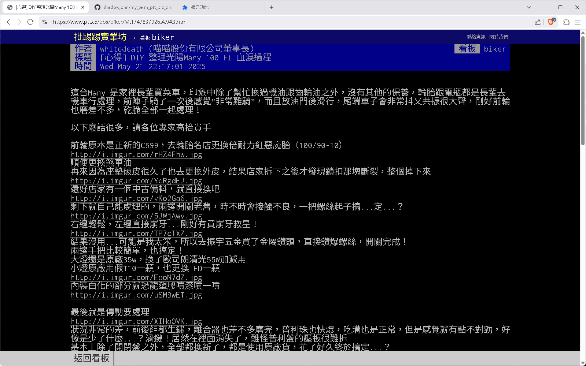
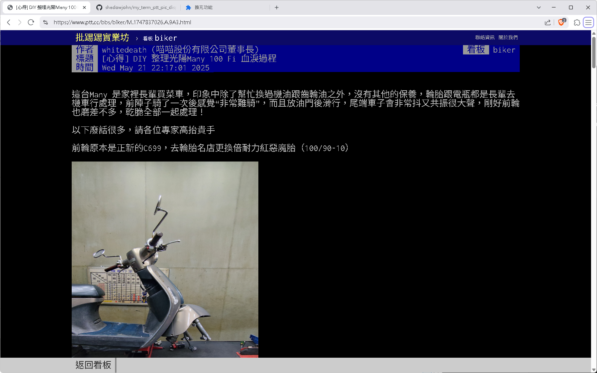

# my_term_ptt_pic_display_extension
用 brave 或 chrome 連 ptt 時，滑鼠移到 link 可以直接顯示圖片或影片

<h2>功能：</h2>
　　總之就是一個可以在 ptt.cc 即時看圖的外掛 
當網頁是：term.ptt.cc 或 www.ptt.cc 時 
遇到 jpg、jpeg、png、gif 直接把圖片插到網址列之前 
網址列滑鼠移過去也會顯示浮動圖片

 
 
<h2>程式開發：</h2>
	作者：羽山秋人 (https://3wa.tw/)
 
 
<h2>License：</h2>
	完全免費的 MIT License
 
 
<h2>最初更新時間：</h2>
	2025-05-23
 
<h2>版本：</h2>
    V0.01 (2025-05-23) 
  
<h2>相依套件：</h2>
	jQuery 3.7.1 
	第三方解  imgur.com CORS proxy: https://proxy.duckduckgo.com  
 

執行前

 

執行後

原始檔下載： 
(V0.01 Beta) https://github.com/shadowjohn/my_term_ptt_pic_display_extension/raw/main/release/V0.01/my_term_ptt_pic_display_extension.zip  

 
 
<h2>版本說明：</h2>
<pre>
  (2025-05-23) V0.01 版：
  初版

<h2>Todo：</h2>
<ul>
  <li>1、影片播放功能，如 Youtube、mp4 link</li>
