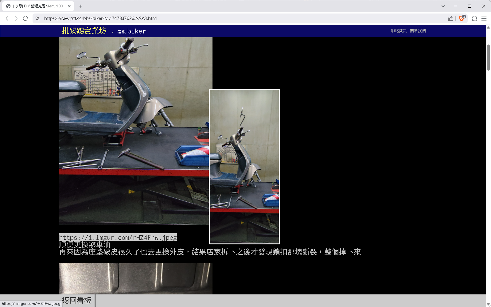

# my_term_ptt_pic_display_extension
用 brave 或 chrome 連 ptt 時，滑鼠移到 link 可以直接顯示圖片或影片

範例1

範例2

總之就是一個可以即時看圖的外掛

當網頁是：term.ptt.cc 或 www.ptt.cc 時
遇到 jpg、jpeg、png、gif 直接把圖片插到網址列之前
網址列滑鼠移過去也會顯示浮動圖片

Todo:
	1. 影片待開發
