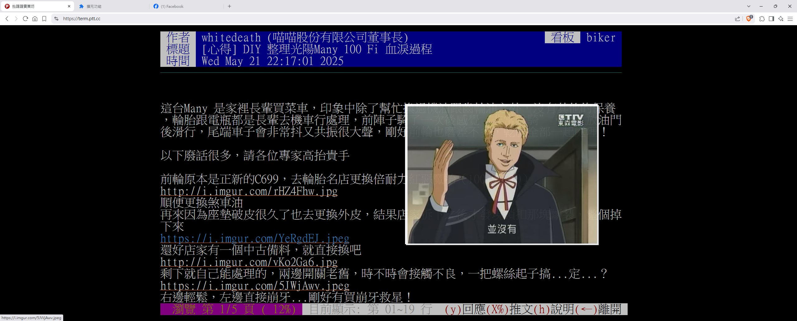

# my_term_ptt_pic_display_extension

> 🖼️ Brave、Chrome、Edge 上在 PTT (term.ptt.cc / www.ptt.cc) 閱讀文章時，滑鼠移動到圖片連結即可預覽圖片／GIF（影片支援預定中）

---

## 📌 功能特色

這是一個可以在 [term.ptt.cc](https://term.ptt.cc) / [www.ptt.cc](https://www.ptt.cc) 即時顯示圖片連結預覽的瀏覽器擴充功能（支援 Brave / Chrome）。

- 當滑鼠移動到圖片連結（如 `.jpg`, `.png`, `.gif` 等）上時，會顯示浮動預覽圖片。
- 圖片會即時插入在文章連結上方，無須開新視窗查看。
- 支援常見圖片主機，例如 imgur、upload.cc、tinyurl 等。

---

## 🧑‍💻 開發者資訊

- 作者：羽山秋人（[https://3wa.tw/](https://3wa.tw/)）
- 初版發佈：2025-05-23
- 授權條款：MIT License（完全免費）

---

## 📦 相依套件

- jQuery 3.7.1
- CORS Proxy（使用 [DuckDuckGo proxy](https://proxy.duckduckgo.com) 來解決跨域問題）

---

## 🌍 圖片主機支援情況

| 主機             | 是否需使用 Proxy |
|------------------|------------------|
| i.meee.com.tw    | 否               |
| tinyurl.com      | 是               |
| upload.cc        | 是               |
| i.imgur.com      | 是               |
| 3wa.tw           | 否               |

---

## 🖼️ 使用前後效果

  
  
執行前

   
  
  
執行後

   
  
  
執行後

---

## 📥 下載與安裝

Google 應用程式線上商店
- [安裝](https://chromewebstore.google.com/detail/mytermpttpicdisplayextens/jenpjbjfghfafojahmldgmkoefacpifa)

下載最新版本：
- [V0.01 Beta 下載連結（2025-05-23）](https://github.com/shadowjohn/my_term_ptt_pic_display_extension/raw/main/release/V0.01/my_term_ptt_pic_display_extension.zip)

---

## 🗒️ 版本紀錄

V0.01 (2025-05-23)
- 初始版本發佈

---

## 🚧 TODO 待辦項目

- [ ] 支援影片連結預覽（如 YouTube、mp4 影片）
- [ ] 更細緻的浮動樣式設計
- [ ] 設定選項（是否啟用 Proxy 等）

