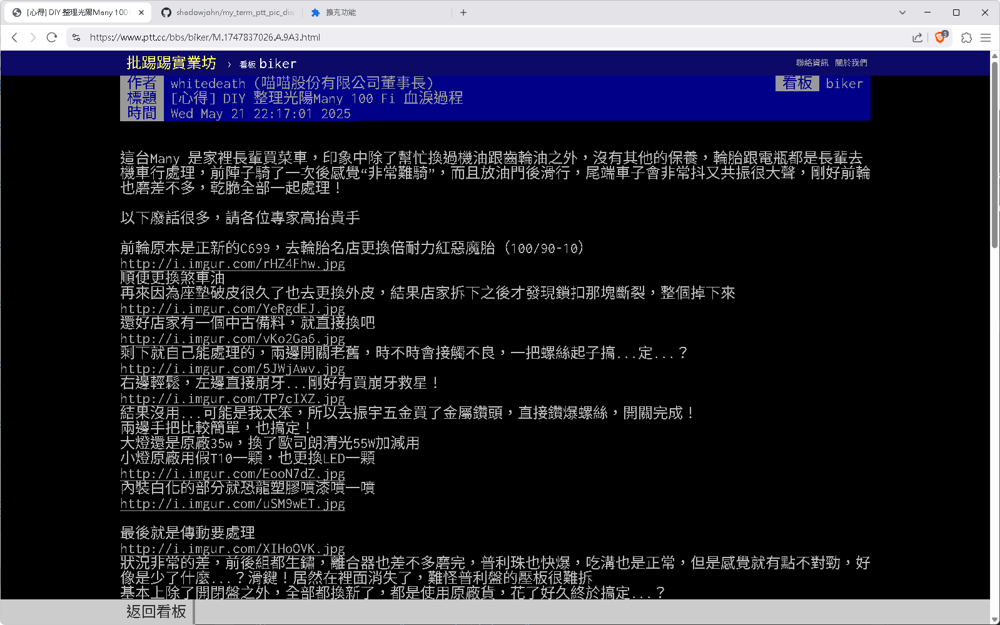
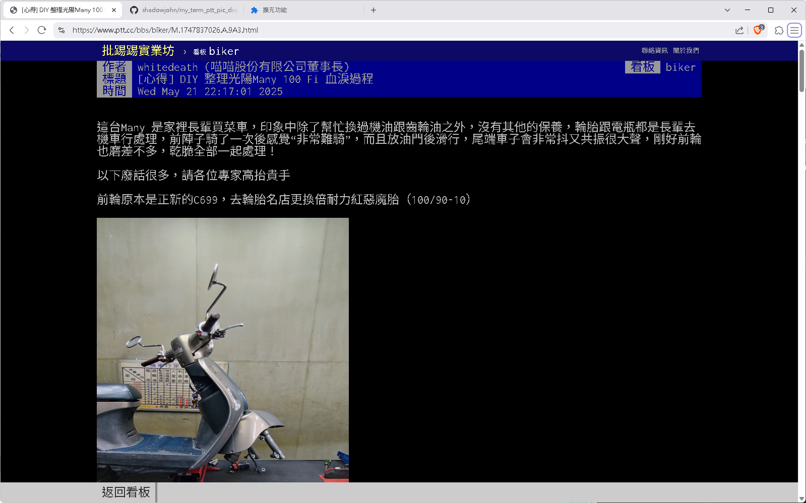
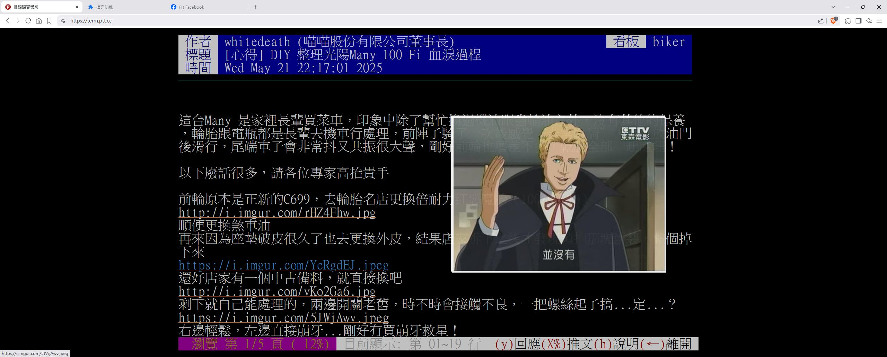
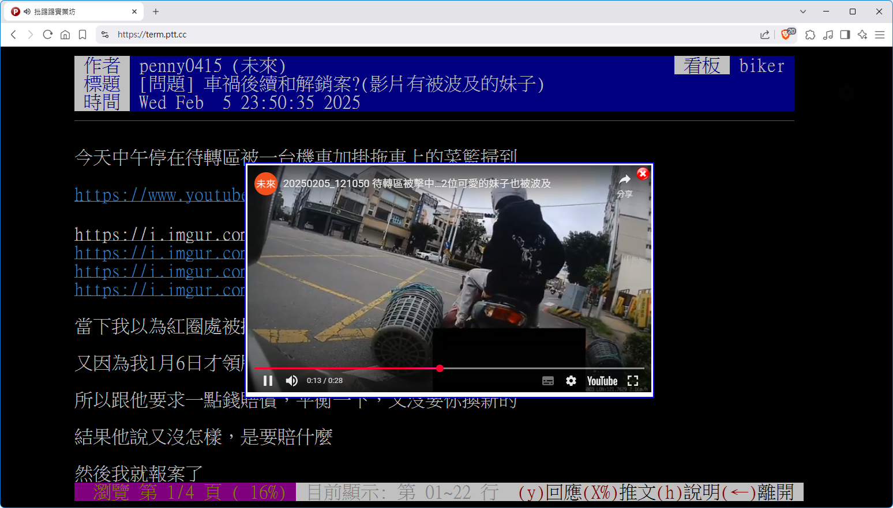

# my_term_ptt_pic_display_extension

> 🖼️ 在 Brave、Chrome、Edge、Firefox 上瀏覽 PTT（term.ptt.cc / www.ptt.cc）時，可直接預覽圖片、GIF 與影片連結。

---

## 📌 功能特色

這是一個可以在 [term.ptt.cc](https://term.ptt.cc) / [www.ptt.cc](https://www.ptt.cc) 即時顯示圖片與影片連結預覽的瀏覽器擴充功能，支援 Brave、Chrome、Edge 與 Firefox。

- 在 term.ptt.cc，當滑鼠移動到圖片連結（如 `.jpg`, `.png`, `.gif` 等）上時，會顯示浮動預覽圖片。
- 在 www.ptt.cc，可在設定中啟用直接插圖，將圖片顯示在文章連結上方，無須開新視窗查看。
- term.ptt.cc 切換畫面時若重複使用既有連結節點，會重新辨識變更後的網址，不會繼續預覽上一張圖片。
- 支援常見圖片主機，例如 imgur、upload.cc、tinyurl、meee.com.tw 等。

---

## 🧑‍💻 開發者資訊

- 作者：羽山秋人（[https://3wa.tw/](https://3wa.tw/)）
- 初版發佈：2025-05-23
- 授權條款：MIT License（完全免費）

## 🤝 貢獻者

- [j108251113](https://github.com/j108251113)：在 [PR #2](https://github.com/shadowjohn/my_term_ptt_pic_display_extension/pull/2) 修正快速切換圖片時，舊圖片載入完成後覆蓋新預覽的競態問題，並附上單元測試與測試紀錄。這是專案第一筆由網友主動提交的功能修正，已於 2026-07-11 正式合併。
- [j108251113](https://github.com/j108251113)：在 [PR #3](https://github.com/shadowjohn/my_term_ptt_pic_display_extension/pull/3) 修正 term.ptt.cc 重用連結節點後，仍預覽舊圖片的問題，已於 2026-08-07 正式合併。

---

## 📦 相依套件

- jQuery 4.0.0（隨 extension 本機封裝，不使用遠端 CDN）
- CORS Proxy（使用 [DuckDuckGo proxy](https://proxy.duckduckgo.com) 來解決跨域問題）

## 🔐 運作範圍與資料流

- 擴充功能只會在 `https://term.ptt.cc/*` 與 `https://www.ptt.cc/*` 啟用。
- `i.imgur.com`、`tinyurl.com`、`upload.cc` 的圖片連結會經 DuckDuckGo proxy 讀取，該圖片網址會傳送給 proxy；其他支援的圖片主機則直接讀取。

---

## 🌍 圖片主機支援情況

| 主機             | 是否需使用 Proxy |
|------------------|------------------|
| i.meee.com.tw    | 否               |
| tinyurl.com      | 是               |
| upload.cc        | 是               |
| i.imgur.com      | 是               |
| 3wa.tw           | 否               |

---

## 🖼️ 使用前後效果

<div align="center">
  
  <p>執行前</p>
  <br>
  
  <p>執行後</p>
  <br>
  
  <p>執行後</p>
  
  <p>執行後，支援 youtube 影片連結</p>
</div>

---

## 📥 下載與安裝

Google 應用程式線上商店
- [安裝] https://chromewebstore.google.com/detail/mytermpttpicdisplayextens/jenpjbjfghfafojahmldgmkoefacpifa 

(Firefox 線上應用程式商店)
- [安裝] https://addons.mozilla.org/zh-TW/firefox/addon/my_term_ptt_pic_display_plugin/ 

下載最新版本：
- [Chrome / Brave / Edge V0.3.6（2026-07-11）](https://github.com/shadowjohn/my_term_ptt_pic_display_extension/raw/main/release/V0.3.6/my_term_ptt_pic_display_extension.zip)
- [Firefox V0.3.6（2026-07-11）](https://github.com/shadowjohn/my_term_ptt_pic_display_extension/raw/main/release/firefox/V0.3.6/my_term_ptt_pic_display_extension.zip)

---

## 🗒️ 版本紀錄
main（未發佈）
- 合併網友 [j108251113](https://github.com/j108251113) 的 [PR #3](https://github.com/shadowjohn/my_term_ptt_pic_display_extension/pull/3)，修正 term.ptt.cc 切換畫面並重用既有連結節點時，圖片預覽仍指向舊網址的問題

V0.3.6 (2026-07-11)
- 合併網友 [j108251113](https://github.com/j108251113) 的 [PR #2](https://github.com/shadowjohn/my_term_ptt_pic_display_extension/pull/2)，修正滑鼠快速切換圖片時的預覽競態，並加入單元測試
- jQuery 升級至 4.0.0 並拆為 `vendor/` 本機檔案
- 主程式、第三方套件與圖片資產分檔
- 簡化 Firefox 產生流程與相容性檢查

V0.3.5 (2025-10-28)
- 空白鍵也要關閉圖片預覽

V0.3.4 (2025-07-07)
- 修正彈出的圖片，不要有 alpha 背景

V0.3.3 (2025-06-24)
- 避免修改原始網址，以免影響文章格式

V0.3.2 (2025-06-19)
- 滑鼠移動到圖片連結時，展開圖片，移開馬上關掉

V0.3.1 (2025-06-17)
- meee.com.tw 網址後面如果是 .gif 誤判加上 .jpeg 的問題

V0.3.0 (2025-06-11)
- 增加圖片預載入功能，避免圖片載入延遲

V0.02 (2025-06-06)
- 增加設定選單
- 設定選項 在 www.ptt.cc 可以強制關掉圖片預覽功能
- 編輯模式時，不會顯示圖片預覽
- 支援影片連結預覽（如 YouTube、mp4 影片）

V0.01 (2025-05-23)
- 初始版本發佈

---

## 🚧 TODO 待辦項目

- [✔] 1. 支援影片連結預覽（如 YouTube、mp4 影片）
- [ ] 2. 更細緻的浮動樣式設計
- [ ] 3. 設定選項（是否啟用 Proxy 等）
- [✔] (V0.02) 4. 增加設定選單
- [✔] (V0.02) 5. 設定選項 在 www.ptt.cc 可以強制關掉圖片預覽功能
- [✔] (V0.3.0) 6. 圖片預載入功能，避免圖片載入延遲
- [✔] (V0.3.1) 7. meee.com.tw 網址後面如果是 .gif 誤判加上 .jpeg 的問題
- [✔] (V0.3.2) 8. 滑鼠移動到圖片連結時，展開圖片，移開馬上關掉
- [✔] (V0.3.3) 9. 避免修改原始網址，以免影響文章格式
- [✔] (V0.3.4) 10. 修正彈出的圖片，不要有 alpha 背景
- [✔] (V0.3.5) 11. 空白鍵也要關閉圖片預覽
- [✔] (V0.3.6) 12. 修正快速切換圖片時，舊圖片載入覆蓋新預覽的競態問題（PR #2）
- [✔] (V0.3.6) 13. jQuery、主程式與圖片資產分檔，並重整 Firefox 產生流程

---

## 🛠️ 開發檢查

```powershell
npm ci
npm run check
```

`npm run check` 會重新產生 Firefox 版本、執行測試，以及檢查 JavaScript / PHP 語法。


