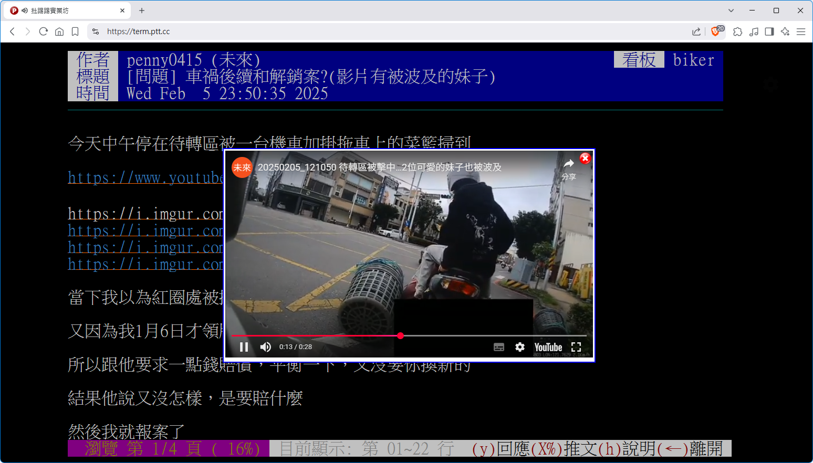

# my_term_ptt_pic_display_extension

> 🖼️ Brave、Chrome、Edge、Firefox 上在 PTT (term.ptt.cc / www.ptt.cc) 閱讀文章時，滑鼠移動到圖片連結即可預覽圖片／GIF（影片支援預定中）

---

## 📌 功能特色

這是一個可以在 [term.ptt.cc](https://term.ptt.cc) / [www.ptt.cc](https://www.ptt.cc) 即時顯示圖片連結預覽的瀏覽器擴充功能（支援 Brave / Chrome）。

- 當滑鼠移動到圖片連結（如 `.jpg`, `.png`, `.gif` 等）上時，會顯示浮動預覽圖片。
- 圖片會即時插入在文章連結上方，無須開新視窗查看。
- 支援常見圖片主機，例如 imgur、upload.cc、tinyurl、meee.com.tw 等。

---

## 🧑‍💻 開發者資訊

- 作者：羽山秋人（[https://3wa.tw/](https://3wa.tw/)）
- 初版發佈：2025-05-23
- 授權條款：MIT License（完全免費）

---

## 📦 相依套件

- jQuery 3.7.1
- CORS Proxy（使用 [DuckDuckGo proxy](https://proxy.duckduckgo.com) 來解決跨域問題）

---

## 🌍 圖片主機支援情況

| 主機             | 是否需使用 Proxy |
|------------------|------------------|
| i.meee.com.tw    | 否               |
| tinyurl.com      | 是               |
| upload.cc        | 是               |
| i.imgur.com      | 是               |
| 3wa.tw           | 否               |

---

## 🖼️ 使用前後效果

  
  
執行前

   
  
  
執行後

   
  
  
執行後

  
  
執行後，支援 youtube 影片連結

---

## 📥 下載與安裝

Google 應用程式線上商店
- [安裝] https://chromewebstore.google.com/detail/mytermpttpicdisplayextens/jenpjbjfghfafojahmldgmkoefacpifa 

(Firefox 線上應用程式商店)
- [安裝] https://addons.mozilla.org/zh-TW/firefox/addon/my_term_ptt_pic_display_plugin/ 

下載最新版本：
- [V0.3.5 Beta 下載連結（2025-10-28）] https://github.com/shadowjohn/my_term_ptt_pic_display_extension/raw/main/release/V0.3.5/my_term_ptt_pic_display_extension.zip 

下載穩定版本：
- [V0.3.4 下載連結（2025-07-07）] https://github.com/shadowjohn/my_term_ptt_pic_display_extension/raw/main/release/V0.3.4/my_term_ptt_pic_display_extension.zip 

---

## 🗒️ 版本紀錄
V0.3.5 (2025-10-28)
- 空白鍵也要關閉圖片預覽

V0.3.4 (2025-07-07)
- 修正彈出的圖片，不要有 alpha 背景

V0.3.3 (2025-06-24)
- 避免修改原始網址，以免影響文章格式

V0.3.2 (2025-06-19)
- 滑鼠移動到圖片連結時，展開圖片，移開馬上關掉

V0.3.1 (2025-06-17)
- meee.com.tw 網址後面如果是 .gif 誤判加上 .jpeg 的問題

V0.3.0 (2025-06-11)
- 增加圖片預載入功能，避免圖片載入延遲

V0.02 (2025-06-06)
- 增加設定選單
- 設定選項 在 www.ptt.cc 可以強制關掉圖片預覽功能
- 編輯模式時，不會顯示圖片預覽
- 支援影片連結預覽（如 YouTube、mp4 影片）

V0.01 (2025-05-23)
- 初始版本發佈

---

## 🚧 TODO 待辦項目

- [✔] 1. 支援影片連結預覽（如 YouTube、mp4 影片）
- [ ] 2. 更細緻的浮動樣式設計
- [ ] 3. 設定選項（是否啟用 Proxy 等）
- [✔] (V0.02) 4. 增加設定選單
- [✔] (V0.02) 5. 設定選項 在 www.ptt.cc 可以強制關掉圖片預覽功能
- [✔] (V0.3.0) 6. 圖片預載入功能，避免圖片載入延遲
- [✔] (V0.3.1) 7. meee.com.tw 網址後面如果是 .gif 誤判加上 .jpeg 的問題
- [✔] (V0.3.2) 8. 滑鼠移動到圖片連結時，展開圖片，移開馬上關掉
- [✔] (V0.3.3) 9. 避免修改原始網址，以免影響文章格式
- [✔] (V0.3.4) 10. 修正彈出的圖片，不要有 alpha 背景
- [✔] (V0.3.5) 11. 空白鍵也要關閉圖片預覽

